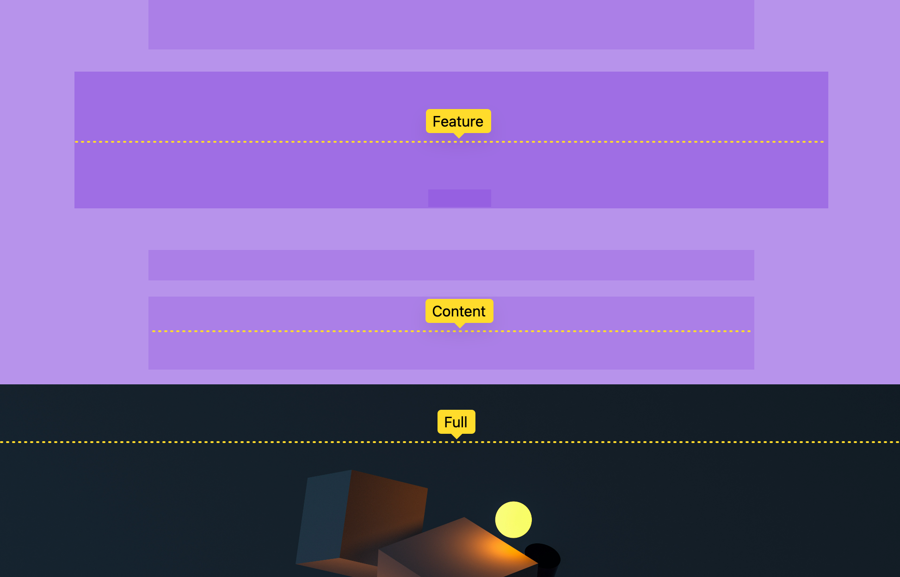
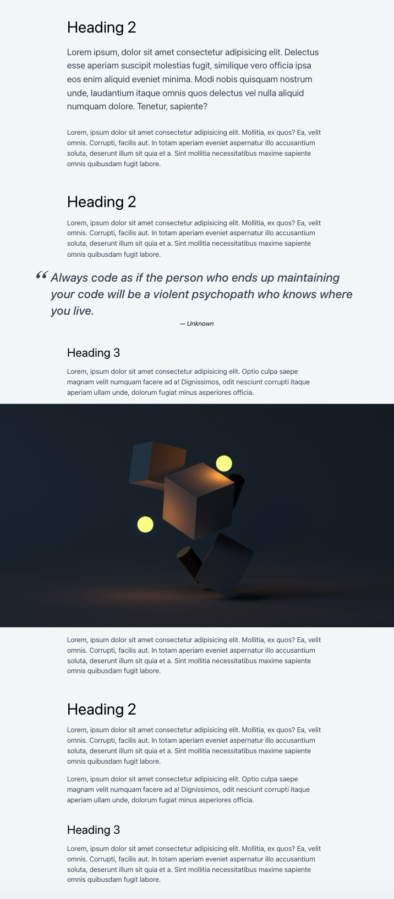

# **Grid Breakout**

## Formål

At lave et layout, der gør det muligt at lave 'breakouts' - elementer, der bryder ud af sidens maksimumbredde for at skabe et dynamisk layout.

## Ressourcer

- [Layout breakouts teknik](https://ryanmulligan.dev/blog/layout-breakouts/)

## Opgavebeskrivelse

Du skal arbejde med denne branch, som indeholder et HTML-dokuement med overskrifter, paragraffer, et citat og et billede. Din opgave er at anvende CSS Grid, i stedet for den teknik, der er anvendt i `style.css`, til at lave et fleksibelt breakout-layout, hvor elementer som citatblokke og billeder strækker sig ud over deres sædvanlige containerbredde.

Du skal navngive dine grid-linjer, så du nemmere kan placere diverse elementer i grid'et (se teknikken under "Ressourcer").

Citatblokken skal udvide sig ud over den normale indholdskolonne – du bestemmer selv, hvor meget.

Billeder skal fylde viewportens bredde.

### Specifikke mål

- Forstå, hvordan CSS Grid hælper med at lave fleksible layouts.
- Arbejde med og ændre eksisterende CSS

> [!NOTE]  
> **Bemærk, at denne branch allerede inkluderer et CSS Reset.**

## Aflevering

Find linket til din løsning på Netlify og aflever det på Fronter.

Link-struktur: **breakout--**[Dit unikke netlify link].netlify.app/

---

Mine noter:

Denne opgave handler om at arbejde med 'grid-template-columns' og navngive de grid-linjer, der afgrænser kolonnerne. Kolonnernes størrelser hentes fra CSS-variabler med 'var()', mens linjerne får navne i firkantede parenteser, fx '[content-start ]'.

Jeg har oprettet fem kolonner på denne måde:

| Yderkant | citat | Tekst/content | citat | Yderkant |
| -------- | ----- | ------------- | ----- | -------- |

article > \* {
grid-column: content;
}

Dette placerer alle de direkte børn af 'article' mellem 'content-start' og 'content-end'. De kommer under hinanden i tekstkolonnen.

Derefter får citatet og billedets wrapper deres egne placeringer:

article > blockquote {
grid-column: quote;
}
Citatet spænder fra 'quote-start' til 'quote-end', altså over tekstkolonnen plus den ekstra plads på begge sider.

article > .break-out {
grid-column: full;
}

Break-out er den class som billed har fået. Billedets wrapper spænder fra 'full-start' til 'full-end', altså over alle fem kolonner. Billedet fylder sin wrapper og får derfor sidens fulde bredde.

Der er blevet brugt nolge 'var()' regler 'da 'full' er blevet taget fra ':root'-en (fra style.css og base.css). Ved at give den en 'gap' der er definret fra en ':root' skire man der bliver ens alle de steder der bruges 'gap', og der er nememr og ændre, hvis den skulle skifte størrelse.

--full: minmax(var(--gap), 1fr);
|
--gap: var(--size-step-0);
|
--size-step-0: clamp(1rem, calc(0.96rem + 0.22vw), 1.13rem);

Det samme med quote;

--quote: minmax(0, var(--size-step-1));
|
--size-step-1: clamp(1.25rem, calc(1.16rem + 0.43vw), 1.5rem);

-- Julie Høyen 20/09-2026
